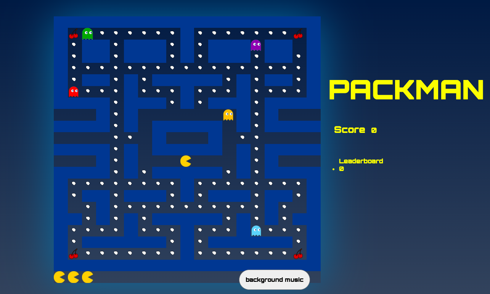
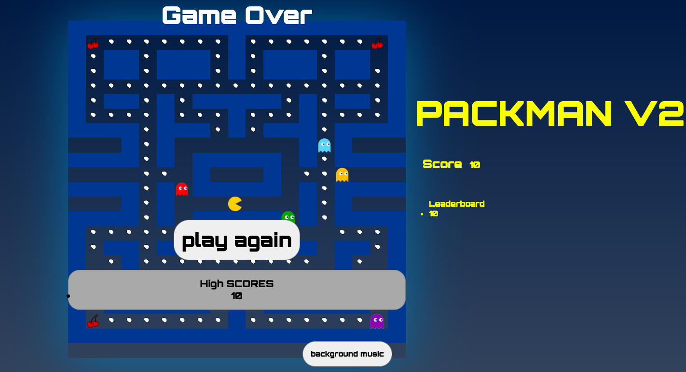

#  Project-1: Pac-Man 

#### General Assembly SEI Project-1 | Pac-Man | Vanilla JavaScript, HTML & CSS | 1-week | Solo project

You can access the game using this link   - https://baraneldemir.github.io/Unit1_Project_Pacman/


## Overview
As for the first project on General Assembly's Software Engineering Immersive, I was tasked with building a grid-based game using Vanilla JavaScript. Since my childhood I was a huge fan of arcade games but Pac-Man was more special than others. I have tried to stay as true as the original as possible. The player will be able to control the character and run away from ghosts. If caught, Pac-Man will lose one of his three lives. And of course the cherries. While cherries eaten, ghosts will be edible and Pac-Man will not die.

## Brief
The brief given was to:
* **Render a game in the browser**.
* **Design logic for winning** & **visually display which player won**.
* **Include separate HTML / CSS / JavaScript files**.
* Stick with **KISS (Keep It Simple Stupid)** and **DRY (Don't Repeat Yourself)** principles.
* Use **Javascript** for **DOM manipulation**.
* **Deploy your game online**, where the rest of the world can access it.
* Use **semantic markup** for HTML and CSS (adhere to best practices).

## Technologies Used
**Frontend**
- HTML5
- CSS3
- JavaScript(ES6)

**Dev Tools**
- Git
- GitHub
- Google Chrome dev tools
- VScode
- ESlint

## Planning
First of all, I started the project with planning. I have decided must haves such as the display of the grid, pacman appearance, movement of user, create the map, adding ghosts to the game, creating a ghost movement function and last but not least die and eat functions. After that I have decided on the features that are nice to haves such as cherries and visual enchantments.

## Process
<p>At the beginning I created the grid and tried to make the Pac-Man move in the grid. I didn't wanted to add anything else such as adding wall collusion or ghosts until I was sure that i was done with the movement.</p>

<p>If I was making a snake game I would choose a similar way to create the map but since Pac-Man maze is quite big, I came to the conclusion that the best approach would be creating the map through an array of numbers. '0' will represent walls, '1' will represent edibles and '2' is empty squares.

Then I added the Pac-Man in and tested that it could move freely across the grid, moving through the tunnel and appearing on the other side and not being able to enter the home of the ghosts. 

To finish the Pac-Man section of the game I added in the dots Pac-Man would be eating to win the game.

After feeling comfortable of moving Pac-Man along the map, it was time to add the ghosts. To create a movement function for the ghost was the part that I spent my time the most on it. I have started with a single ghost. Created a function to move him around randomly to available squares. But then I have realised the ghost was moving back and forth sometimes like it was glitching. To solve this problem I have added an array called previously moved and made ghost not to move the squares that they came from. It worked like a charm. 

After making sure ghost movement was natural and not glitchy, I have moved on to make it more like a game and created a die function for Pac-Man so that it was playable. This was fairly easy since creating a function where ghost position and Pac-Man was the same die function would occur and one health would be lost.
</p>

###### Pac-Man Runs Into Clyde

``` javascript
function pacmanDie(position) {
    if (pacmanCurrentPosition === position){
        removePacman(pacmanCurrentPosition)
        pacmanCurrentPosition = pacmanStartingPosition
        addPacman(pacmanCurrentPosition)
        updateHealth()
        playDeath()
    }
}
```

Now I have a map, movement of Pac-Man, movement of ghosts, die function and win lose screens. It was a proper playable game. It was time to move on to nice to have section on my planning. Cherries! Firstly i displayed cherries in the map with '8' and when Pac-Man recieves the cherry all the ghosts will stop and become edible. This feature was cruel to me since if players get stucks between ghosts, they had a last option as to eat the cherry and runaway from ghosts.

After adding other ghosts and increasing the speed a little bit it was a really hard game. At this point I have played the game a lot and playing a game that you have created is an must have feeling.

## Screenshots
<p>
Game Screen

</p>
<p>
Lost Screen

</p>

## Challenges
<p> The biggest challange of mine in coding of Pac-Man game is the movement of ghosts since they do not move randomly as people may think. I have read a few documentations specifically on ghost movements and interactions. Every ghost has it's unique pathing and movement triggers.  


###### Logic for Ghost movement.
``` javascript
function ghostMove(ghost) {
    const availableMoves = []
    const upWall = cells[(ghost.ghostCurrentPosition - width)].classList.contains("pixelWall")
    const downWall = cells[(ghost.ghostCurrentPosition + width)].classList.contains("pixelWall")
    const rightWall = cells[(ghost.ghostCurrentPosition + 1)].classList.contains("pixelWall")
    const leftWall = cells[(ghost.ghostCurrentPosition - 1)].classList.contains("pixelWall")
    if (!upWall){
        availableMoves.push("ghostUp")
    }
    if (!downWall){
        availableMoves.push("ghostDown")
    }
    if (!rightWall){
        availableMoves.push("ghostRight")
    }
    if (!leftWall){
        availableMoves.push("ghostLeft")
    }
    const moveToRemove = availableMoves.indexOf(ghost.previousMove)
    if(moveToRemove !== -1 && ghost.ghostCurrentPosition !== 190 && ghost.ghostCurrentPosition !== 208){
        availableMoves.splice(moveToRemove, 1)
    }
    const anyDirection = availableMoves[Math.floor(Math.random() * availableMoves.length)]
    removeGhost(ghost.name, ghost.ghostCurrentPosition) 
            if (anyDirection === "ghostUp" && !upWall){
                ghost.ghostCurrentPosition -= width 
                ghost.previousMove = "ghostDown"
            }else if (anyDirection === "ghostDown" && !downWall){
                ghost.ghostCurrentPosition += width 
                ghost.previousMove = "ghostUp"
            }else if (anyDirection === "ghostRight" && !rightWall) {
                if(ghost.ghostCurrentPosition === 208){
                ghost.ghostCurrentPosition = 190
                }
                ghost.ghostCurrentPosition++
                ghost.previousMove = "ghostLeft"
            }else if(anyDirection === "ghostLeft" && !leftWall){
                if(ghost.ghostCurrentPosition === 190){
                    ghost.ghostCurrentPosition = 208
                }
                ghost.ghostCurrentPosition-- 
                ghost.previousMove = "ghostRight"
            }else {
                console.log(anyDirection)
                console.log(ghost.ghostCurrentPosition)
            }
    addGhost(ghost.ghostCurrentPosition, ghost.name)
    pacmanDie(ghost.ghostCurrentPosition)
}
```

## Wins
While getting the ghosts to move was both my biggest challenge and my biggest win, I am really proud of the way I have created the map. The grid for Pac-Man is a classic and because I was trying to be as true to the arcade game as possible, getting it right was very important to me. So I have created this array map. And the way the result is displayed is also something that I had to work around because I was using Vanilla JavaScript. In the end I manipulated CSS to achieve the dynamic pop-up I was looking for.

###### The creation of grid. Since its dynamic, it would be fairly easy to create other levels of maps with this technic. 
```javascript
function createGrid(){
    board = [
        0, 0, 0, 0, 0, 0, 0, 0, 0, 0, 0, 0, 0, 0, 0, 0, 0, 0, 0,
        0, 8, 1, 1, 1, 1, 1, 1, 1, 0, 1, 1, 1, 1, 1, 1, 1, 8, 0,
        0, 1, 0, 0, 1, 0, 0, 0, 1, 0, 1, 0, 0, 0, 1, 0, 0, 4, 0,
        0, 1, 0, 0, 1, 0, 0, 0, 1, 0, 1, 0, 0, 0, 1, 0, 0, 1, 0,
        0, 1, 1, 1, 1, 1, 1, 1, 1, 1, 1, 1, 1, 1, 1, 1, 1, 1, 0,
        0, 1, 0, 0, 1, 0, 1, 0, 0, 0, 0, 0, 1, 0, 1, 0, 0, 1, 0,
        0, 1, 1, 1, 1, 0, 1, 1, 1, 0, 1, 1, 1, 0, 1, 1, 1, 1, 0,
        0, 0, 0, 0, 1, 0, 0, 0, 1, 0, 1, 0, 0, 0, 1, 0, 0, 0, 0,
        2, 2, 2, 0, 1, 0, 2, 2, 2, 2, 2, 2, 2, 0, 1, 0, 2, 2, 2,
        0, 0, 0, 0, 1, 0, 2, 0, 0, 0, 0, 0, 2, 0, 1, 0, 0, 0, 0,
        2, 2, 2, 2, 1, 1, 2, 0, 3, 3, 3, 0, 2, 1, 1, 2, 2, 2, 2,
        0, 0, 0, 0, 1, 0, 2, 0, 0, 0, 0, 0, 2, 0, 1, 0, 0, 0, 0,
        2, 2, 2, 0, 1, 0, 2, 2, 2, 2, 2, 2, 2, 0, 1, 0, 2, 2, 2,
        0, 0, 0, 0, 1, 0, 1, 0, 0, 0, 0, 0, 1, 0, 1, 0, 0, 0, 0,
        0, 1, 1, 1, 1, 1, 1, 1, 1, 0, 1, 1, 1, 1, 1, 1, 1, 1, 0,
        0, 1, 0, 0, 1, 0, 0, 0, 1, 0, 1, 0, 0, 0, 1, 0, 0, 1, 0,
        0, 4, 1, 0, 1, 1, 1, 1, 1, 1, 1, 1, 1, 1, 1, 0, 1, 4, 0,
        0, 0, 1, 0, 1, 0, 1, 0, 0, 0, 0, 0, 1, 0, 1, 0, 1, 0, 0,
        0, 1, 1, 1, 1, 0, 1, 1, 1, 0, 1, 1, 1, 0, 1, 1, 1, 1, 0,
        0, 1, 0, 0, 0, 0, 0, 0, 1, 0, 1, 0, 0, 0, 0, 0, 0, 1, 0,
        0, 8, 1, 1, 1, 1, 1, 1, 1, 0, 1, 1, 1, 1, 1, 1, 1, 8, 0,
        0, 0, 0, 0, 0, 0, 0, 0, 0, 0, 0, 0, 0, 0, 0, 0, 0, 0, 0,
        9, 9, 9, 2, 2, 2, 2, 2, 2, 2, 2, 2, 2, 2, 2, 2, 2, 2, 2
    ]
    for (let i = 0; i < cellCount; i++ ){
    const cell = document.createElement("div")
    cell.dataset.index = i  
    cell.style.height = `${100 / height}%`
    cell.style.width = `${100 / width}%`
    grid.appendChild(cell)
    cells.push(cell)
    }
```

###### The walls
```javascript
function createWalls() {
    board.forEach((cell, idx) => {
    if(cell===0 ){
        cells[idx].classList.add("pixelWall")
    }
    })
}
```
Having a seperate interval function to ghost movements was also something that i was proud of so that i can easily increase the difficulty level of the game. 
###### Ghost interval
```javascript
function ghostsStartMoving(){
    ghosts.forEach((ghost, idx) => { 
        letsMove[idx] = setInterval(() => ghostMove(ghost), 180) 
    }) 
}  
    let score = 0
    document.querySelector(".score").innerHTML = score
```


## Key Learnings
<p>It was great to put into practice and consolidate everything I had been learning for the first month of the course. Doing this project also really helped me put my coding process into perspective. I didn't spend much time in the planning stage as I was eager to start coding. This made me spend a lot of time refactoring my code about issues I could have foreseen in the wireframing stage. 

Also, as it was a solo project, and the first project we ever did, I didn't ask for help as much as I should have. I believed I should persevere and fix things myself, which in the end had the opposite effect and got me frustrated and I ended up losing time. These two points really taught me valuable lessons and I shifted my mindset moving forward.

Another key takeaway for me that translated into a bigger lesson, was the movement of the ghosts. This turned out to be much more complex than I had initially thought, I ended up breaking things down a lot and taking it step by step which in the end helped me speed up. Seeing this was a real eye opener. 
</p>

## Future Features

If I had more time on this project I would add:
- Level 2 by generating different and harder maps
- Different movements and patterns for the ghosts.
- The background music of original Pac-Man.

Thank you for checking out my first game! I hope you enjoyed.


